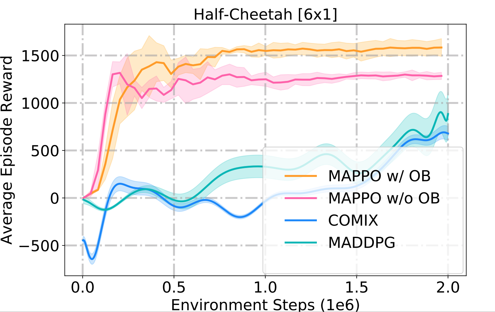

# Settling-the-Variance-of-Multi-Agent-Policy-Gradients
Describe in the paper "Settling the Variance of Multi-Agent Policy Gradients", this repository applies the optimal baseline (OB) technique to MAPPO algorithms and tests on SMAC & Multi-agent MuJoCo, aiming to stabilise training and improve performance. 

## Installation
### Create environment
``` Bash
conda create -n ob python=3.9
conda activate ob
pip install -r requirements.txt
conda install pytorch torchvision torchaudio cudatoolkit=11.1 -c pytorch -c nvidia
pip install -e .
```

### Multi-agent MuJoCo
Following the instructios in https://github.com/openai/mujoco-py and https://github.com/schroederdewitt/multiagent_mujoco to setup a mujoco environment. In the end, remember to set the following environment variables:
``` Bash
LD_LIBRARY_PATH=${HOME}/.mujoco/mujoco200/bin;
LD_PRELOAD=/usr/lib/x86_64-linux-gnu/libGLEW.so
```
### StarCraft II & SMAC
Run the script
``` Bash
bash install_sc2.sh
```
Or you could install them manually to other path you like, just follow here: https://github.com/oxwhirl/smac.

## How to run
When your environment is ready, you could run shell scripts provided. For example:
``` Bash
cd onpolicy/scripts
./train_mujoco.sh  # run with Multi-agent MuJoCo
./train_smac.sh  # run with StarCraft II
```
If you would like to change the configs of experiments, you could modify sh files or look for config files for more details. e.g. For SMAC, they're located in onpolicy/config/config_smac.py

## Some results

### SMAC


### Multi-agent MuJoCo




