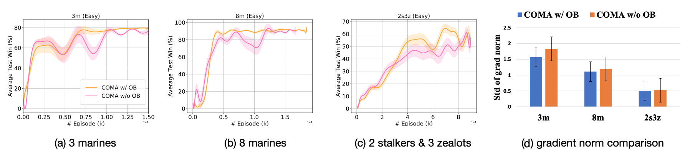
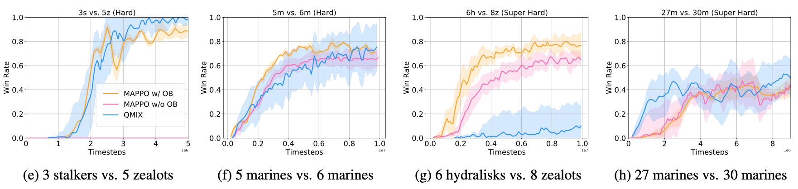

# Settling-the-Variance-of-Multi-Agent-Policy-Gradients
Describe in the paper "Settling the Variance of Multi-Agent Policy Gradients", this repository applies the optimal baseline (OB) technique to MAPPO/COMA algorithms and tests on SMAC & Multi-agent MuJoCo, aiming to stabilise training and improve performance. 

## Installation
### Create environment
``` Bash
conda create -n ob python=3.9
conda activate ob
pip install -r requirements.txt
conda install pytorch torchvision torchaudio cudatoolkit=11.1 -c pytorch -c nvidia
```

### Multi-agent MuJoCo
Following the instructios in https://github.com/openai/mujoco-py and https://github.com/schroederdewitt/multiagent_mujoco to setup a mujoco environment. In the end, remember to set the following environment variables:
``` Bash
LD_LIBRARY_PATH=${HOME}/.mujoco/mujoco200/bin;
LD_PRELOAD=/usr/lib/x86_64-linux-gnu/libGLEW.so
```
### StarCraft II & SMAC
Run the script
``` Bash
bash install_sc2.sh
```
Or you could install them manually to other path you like, just follow here: https://github.com/oxwhirl/smac.

## How to run
When your environment is ready, you could run shell scripts provided. For example:
``` Bash
cd mappo/scripts
./train_mujoco.sh  # run with MAPPO on Multi-agent MuJoCo
./train_smac.sh  # run with MAPPO on StarCraft II

cd coma
./train_smac.sh  # run with COMA on StarCraft II
```
If you would like to change the configs of experiments, you could modify sh files or look for config files for more details. e.g. For MAPPO on SMAC, they're located in mappo/config/config_smac.py (--use_ob is the switch of OB)

## Example PyTorch-like pseudocode for applying OB

### Discrete
```python
import torch, torch.nn.functional as F

# x: batch of row vectors to normalise to probability mass
normalize = lambda x: F.normalize(x, p=1, dim=-1)

# q: Q values of actions of agent i 
# pi: policy of agent i
def optimal_baseline(q, pi):
    M = torch.norm(pi, dim=-1, keepdim=True) ** 2 + 1 
    xweight = normalize((M - 2 * pi) * pi)
    return (xweight * q).sum(-1)

# compute the policy and sample an action from it
a, pi = actor(obs)
q = critic(obs)

#compute OB
ob = optimal_baseline(q, pi)

# use OB to construct the loss
q = q.gather(-1, a)
pi = pi.gather(-1, a)
X = q - ob
loss = -(X * torch.log(pi)).mean()
```

### Continuous
```python
import torch, torch.nn.functional as F

# x: batch of row vectors to normalise to probability mass
normalize = lambda x: F.normalize(x, p=1, dim=-1)

# a: sampled actions of agent i
# q: Q values of the sampled actions
# mu, std: parameters of the Gaussian policy of agent i
def optimal_baseline(a, q, mu, std):
    mu_term = torch.norm((a - mu)/std**2, dim=-1)
    std_term = torch.norm(((a - mu)**2 - std**2)/std**3, dim=-1)
    xweight = normalize(mu_term**2 + std_term**2)
    return (xweight * q).sum(-1)

# normal sampling step, where log_pi is the log probability of a
a, log_pi = actor(obs, deterministic=False)
q = critic(obs, a)

# resample m (e.g., m=1000) actions for the observation
obs_m = obs.unsqueeze(0).repeat(m, 1)
a_m, mu_m, std_m = actor(obs, deterministic=False)

# approximate OB
q_m = critic(obs, a_m)
ob = optimal_baseline(a_m, q_m, mu_m, std_m)

# use OB to construct the loss
X = q - ob
loss = -(X * log_pi).mean()
```

## Some results

### SMAC on COMA



### SMAC on MAPPO



### Multi-agent MuJoCo on MAPPO


